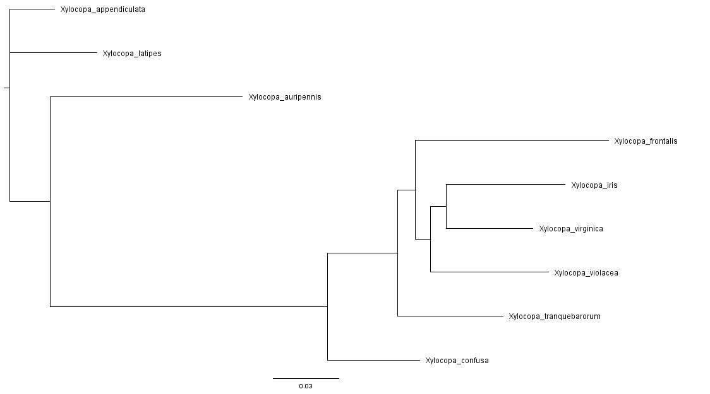

# Xylocopa Phylogeny Project

## Project Overview

This project aimed to analyze the phylogeny of the genus *Xylocopa*. The workflow includes:

- Download genetic sequences for *Xylocopa* from BOLD and NCBI.
- Clean and standardize the data (FASTA format, remove duplicates, remove empty sequences).
- Separate sequences by species.
- Generate consensus sequences for each species.
- Align sequences and build gene trees.

---
## Pipeline Overview

The full analysis pipeline involved the following steps:

### 1. **Data Retrieval**

   Download sequences from BOLD:
   ```bash
   bash BOLD_FASTA.sh -t Xylocopa -m COI -o BOLD-COI.fasta
  ```

   Download sequences from NCBI:
   ```bash
   bash NCBI_NUCLEOTIDE.sh -t Xylocopa -m COI -o NCBI-COI.fasta
   bash NCBI_NUCLEOTIDE.sh -t Xylocopa -m COX1 -o NCBI-COX1.fasta
   bash NCBI_NUCLEOTIDE.sh -t Xylocopa -m PEPCK -o NCBI-PEPCK.fasta
   bash NCBI_NUCLEOTIDE.sh -t Xylocopa -m EF1A -o NCBI-EF1A.fasta
  ```

### 2. **Sequence Deduplication and Merging**
   Use the `dedup_fasta.sh` script to compare accessions from both sources and merge them into a unified, deduplicated FASTA:
   ```bash
   bash dedup_fasta.sh -o BN-COI BOLD-COI.fasta NCBI-COI.fasta
  ```

### 3. **Split by Species**

  Split cleaned FASTA into per-species files:
  ```bash
  bash split_by_species.sh NCBI-COX1.fasta
  bash split_by_species.sh NCBI-PEPCK.fasta
  bash split_by_species.sh NCBI-EF1A.fasta
  bash split_by_species.sh BN-COI.fasta
  ```

### 4. **Identify Common Species Across Markers**

  After generating species lists for each gene marker, use the `common_species.sh` script to find species present in *all* markers. This ensures downstream analyses focus on species with multi-locus data.
  ```bash
  bash common_species.sh NCBI-COX1/species_list.txt NCBI-PEPCK/species_list.txt NCBI-EF1A/species_list BN-COI/species_list
  ```

### 5. **Concatenate Random Sequences Across Markers**

  Using the `RandCatSeq.sh` script, concatenate one randomly selected sequence per species from each marker directory into a single multi-locus FASTA file.
  ```bash
  bash RandCatSeq.sh -o Xylocopa_Final.fasta species_list.txt NCBI-COX1/ NCBI-PEPCK/ NCBI-EF1A/ BN-COI/
  ```

### 6. **Align Concatenated Sequences**

  Use MUSCLE v3.8.31 to perform multiple sequence alignment on the concatenated FASTA file.
  ```bash
    ./muscle3.8.31_i86linux64 -in Xylocopa_Final.fasta -out Xylocopa_aligned.fasta
 ```

### 7. **Build and Visualize Phylogenetic Tree**

Load the IQ-TREE module and construct a phylogenetic tree:
 ```bash
    module load iqtree/2.2.2.6
    iqtree2 -s Xylocopa_aligned.fasta
 ```
To visualize the tree:

-Download the `.treefile` to your local machine (Use `scp`).

-Open it with [**FigTree**](http://tree.bio.ed.ac.uk/software/figtree/).

---
## Results and Discussion

All custom scripts successfully completed their functions, from sequence retrieval and cleaning to species filtering and concatenation. The final phylogenetic tree built using IQ-TREE is shown below:



The objective of this project was to analyze the phylogeny of the genus *Xylocopa* with representatives from all distinct subgenera. However, only **eight** out of the 37 known subgenera were present across all markers (COX1, COI, PEPCK, EF1A), limiting the ability to fully resolve the genus phylogeny.

The species present across all markers were:

- *Xylocopa (Alloxylocopa) appendiculata*  
- *Xylocopa (Biluna) auripennis*  
- *Xylocopa (Maiella) confusa*  
- *Xylocopa (Neoxylocopa) frontalis*  
- *Xylocopa (Copoxyla) iris*  
- *Xylocopa (Platynopoda) latipes*  
- *Xylocopa (Biluna) tranquebarorum*  
- *Xylocopa (Xylocopa) violacea*  
- *Xylocopa (Xylocopoides) virginica*

While most belong to distinct subgenera, two species from the same subgenus are separated in the tree. This separation likely reflects limitations in the analysis or marker selection rather than true evolutionary relationships.

Additionally, this analysis may be limited by incorrect species identification, as it relies on species names assigned in BOLD and NCBI databases, which could contain misidentified or mislabeled sequences.

Although individual markers like COI contained up to **163 species**, requiring presence across all markers caused a significant reduction in species overlap.

Because `RandCatSeq.sh` randomly selects sequences per species and marker, the exact alignment and resulting tree may vary between runs unless sequence selection is fixed.

Given these findings, future studies might focus on fewer or alternative markers to improve species coverage and subgeneric resolution within *Xylocopa*.

---

## BOLD FASTA Downloader

[BOLD_FASTA.sh](Sequences/BOLD/BOLD_FASTA.sh)

I developed a bash script that automates downloading DNA sequences from the BOLD database in FASTA format, building on the [BOLD-CLI](https://github.com/CNuge/BOLD-CLI) tool.

Note: This script was developed and tested on the UCLA Hoffman2 high-performance computing cluster. It uses environment modules (e.g., module load) and may not run as-is standard desktop systems without modification. 

### Features

- Downloads sequences in FASTA format using BOLD-CLI.
- Allows filtering by taxon, geographic location, and barcode marker.
- Cleans and formats sequences, removing duplicates and empty sequences.
- Generates a .txt file listing sequences that are empty or inaccessible.

### Usage

Run the script from the terminal with the following command:

```bash
bash BOLD_FASTA.sh -t TAXON [-l LOCATION] [-m MARKER] [-o OUTPUT]
```

**Options:**

- `-t TAXON`: *(required)* Species name or taxa list.
- `-l LOCATION`: *(optional)* Geographic region to filter sequences.
- `-m MARKER`: *(optional)* Barcode marker (e.g., COI-5P, matK, rbcL).
- `-o OUTPUT`: *(optional)* Output FASTA filename (default: `bold_data.fasta`).

### Output

- A FASTA file containing the cleaned sequences.
- A `.txt` file (`skipped_sequences.txt`) listing headers of sequences that were empty or inaccessible.

---

## NCBI Nucleotide Downloader

[NCBI_NUCLEOTIDE.sh](Sequences/NCBI/NCBI_NUCLEOTIDE.sh)

This script automates downloading nucleotide sequences in FASTA format from NCBI GenBank using [Entrez Direct (EDirect)](https://www.ncbi.nlm.nih.gov/books/NBK179288/). It allows flexible searching by taxon, marker, and geographic location.

Note: This script is designed for use on the UCLA Hoffman2 high-performance computing cluster, where `esearch` and `efetch` are available via EDirect. It may require adaptation for other systems.

### Features

- Downloads sequences from NCBI's nuccore database in FASTA format.
- Allows filtering by taxon, geographic location, and barcode marker.
- Filters GenBank records locally before converting to FASTA.
- Outputs the number of sequences retrieved.

### Usage

Run the script from the terminal with the following command:

```bash
bash NCBI_NUCLEOTIDE.sh -t TAXON [-l LOCATION] [-m MARKER] [-o OUTPUT]
```

**Options:**

- `-t TAXON`: *(required)* Species name or taxa list.
- `-l LOCATION`: *(optional)* Geographic region to filter sequences.
- `-m MARKER`: *(optional)* Gene name or marker.
- `-o OUTPUT`: *(optional)* Output FASTA filename (default: `ncbi_data.fasta`).

### Output

- A FASTA file containing sequences that match the query and location.
- Debug output showing the full query and number of sequences retrieved.

---

## FASTA Deduplicator and Comparator  

[dedup_fasta.sh](/Sequences/FINAL/JOINED/dedup_fasta.sh)

This script compares two FASTA files by their **accession numbers** (ignoring version numbers like `.1`, `.2`) and identifies sequences that are unique to each file or shared between them. It then outputs a merged, **deduplicated** FASTA file, retaining the **longest version** of each shared accession.

It is useful for cleaning and combining datasets from different sources (e.g., BOLD and NCBI) before downstream phylogenetic analysis.

### Features

- Compares FASTA accessions, ignoring version suffixes (e.g., `>ABC123.1` → `ABC123`).
- Outputs:
  - Unique accessions from each input file.
  - Shared accessions between both files.
  - A deduplicated FASTA file retaining the longest version per accession.
- Supports debug mode via the `DEBUG=1` environment variable.

### Usage

Run the script from the terminal with:

```bash
bash dedup_fasta.sh [-o OUTPUT_BASENAME] file1.fasta file2.fasta
```

---

## Species Splitter  
[split_by_species.sh](/Sequences/FINAL/split_by_species.sh)

This script processes a FASTA file and splits it into **one file per species**, based on species names parsed from the FASTA headers. It also creates a summary file listing all detected species and the number of sequences per species. This is a key preprocessing step before generating per-species consensus sequences.

### Features

- Accepts a single multi-species FASTA file as input.
- Extracts and counts species from FASTA headers.
- Produces:
  - `species_list.txt`: Tab-separated list of species and sequence counts.
  - Individual FASTA files, one per species, in a new directory.
- Handles carriage returns and non-standard line endings.
- Optionally enables debug output for troubleshooting.

### Assumptions

- The species name appears after the accession in each FASTA header, e.g.:  
  `>ABC123 Genus species`  
  `>XYZ789 Genus species2`

### Usage

```bash
bash split_by_species.sh [-d] input.fasta
```
---

## Common Species Finder  
[common_species.sh](/Sequences/FINAL/RESULTS/common_species.sh)

This script identifies the species names **common to multiple input species lists**. It compares two or more tab-separated species list files (each listing species and counts) and outputs a list of species present in *all* provided files.

### Features

- Accepts two or more species list files as input.
- Extracts species names (ignoring the last column, typically counts).
- Filters out lines containing "sp." to exclude unidentified or ambiguous species.
- Outputs a file `species_list.txt` containing species names common to all input files.

### Usage

```bash
bash common_species.sh file1.txt file2.txt [file3.txt ...]
```

---

## Random Sequence Concatenator  
[RandCatSeq.sh](/Sequences/FINAL/RESULTS/RandCatSeq.sh)

This script concatenates sequences from multiple directories for a list of species by selecting **one random sequence per species per directory** and joining them into a single FASTA file. This is useful for creating multi-locus concatenated datasets from separate gene alignments or per-species FASTA files.

### Features

- Takes a species list file and one or more directories containing species FASTA files.
- For each species, randomly selects one sequence from each directory (gene marker).
- Concatenates the selected sequences into one FASTA entry per species.
- Outputs a single concatenated FASTA file.
- Optional debug mode to track files found and sequences extracted.

### Usage

```bash
bash RandCatSeq.sh [-d] [-o OUTPUT] species_list.txt dir1 [dir2 ...]
```

### Options

- `-d`: Enable debug output.
- `-o`: Specify output filename. Default is `concatenated_sequences.fasta`.
- `-h`: Show help message.

### Input

- `species_list.txt`: A plain text file listing species names, one per line.
- `dir1`, `dir2`, ... : Directories containing per-species FASTA files named `<species_name>.fasta`. Spaces in species names are converted to underscores in filenames.

### Output

- A single concatenated FASTA file (`concatenated_sequences.fasta` by default) with one entry per species.  
  Each entry header is the species name, and the sequence is the concatenation of randomly selected sequences from each input directory.

### Requirements

- Bash shell with standard Unix utilities (`awk`, `grep`, `fold`).
- FASTA files with sequences per species in the specified directories.

